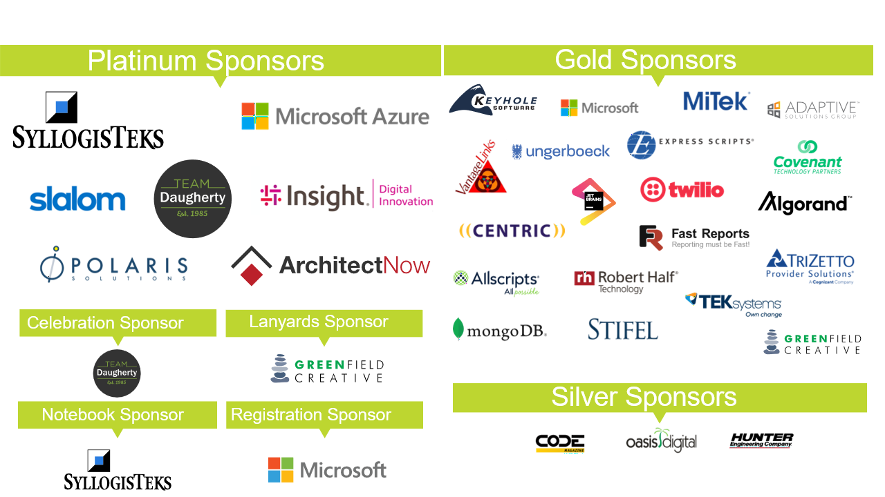

# <!--fit--> Data Science Toolbox with Python

### *Workshop Introduction*

---

---

    

[nathan.brown@daugherty.com]()

---

  

 

  
  
  

Icons made by [RoundIcons](https://www.flaticon.com/authors/roundicons) from [www.flaticon.com](www.flaticon.com)

---

[https://github.com/nbrown273/dsml-toolbox-python](https://github.com/nbrown273/dsml-toolbox-python)